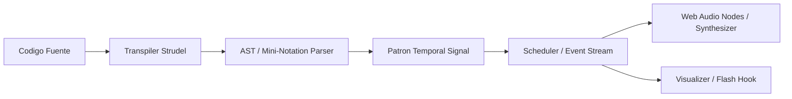

# SKILL: STRUDEL ENGINE

## DESCRIPCION
Especializacion tecnica en el motor de evaluacion musical de Strudel, parsing de sintaxis TidalCycles / mini-notation, orquestacion de Web Audio API, integracion de CodeMirror y modo de ejecucion offline.

## ARQUITECTURA DEL MOTOR

### 1. Pipeline de Evaluacion

### 2. Componentes Clave
- `@strudel/transpiler`: Transforma cadenas de mini-notation (ej. `sound("bd [sd hh]")`) en estructuras funcionales evaluables.
- `@strudel/core`: Provee primitivas temporales, ciclos, transformaciones de fase, velocidad y funciones de orden superior sobre senales continuas y discretas.
- `@strudel/webaudio`: Instancia AudioContext, maneja buffers de audio PCM y administra bancos de samples locales sin requerir red.
- `@strudel/repl`: Frontend interactivo que contiene el editor CodeMirror 6, decoradores de sintaxis, atajos de teclado (Ctrl+Enter / Cmd+Enter) y renderizadores de ciclo.

## PAUTAS DE EJECUCION OFFLINE
1. Los soundfonts y samples deben resolverse contra rutas locales relativas en el filesystem o endpoints locales controlados, nunca contra CDNs remotas (servidores web externos, cdnjs, unpkg).
2. El AudioContext debe manejarse de forma desacoplada: suspender en inactividad y reanudar tras interaccion de usuario en el Webview o Standalone.
3. Las pruebas sin GUI deben apoyarse en evaluacion determinista de eventos temporales (dry-run) sin instanciar la Web Audio API del navegador.
