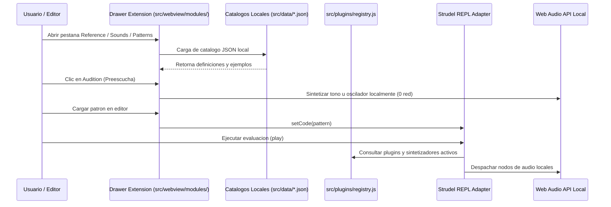
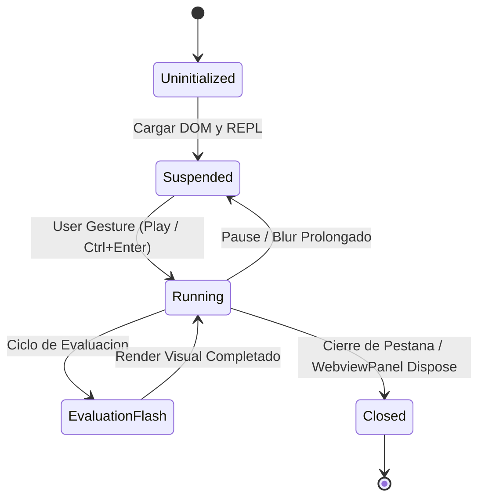
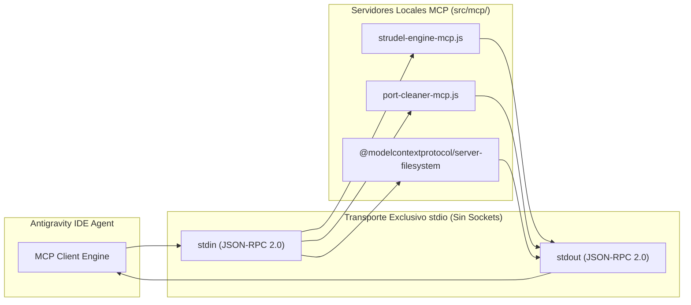

# ARQUITECTURA DEL SISTEMA: STRUDEL LOCAL

## 1. VISION GENERAL
Strudel Local implementa una arquitectura de ejecucion dual disenada para operar de forma 100% offline sin dependencias de red externas:
1. Extension para Antigravity IDE / VS Code (.vsix): Interfaz interactiva embebida en Webview con canal IPC postMessage seguro.
2. Modulo Local Standalone: SPA local offline servida por un runtime ligero en Node.js para uso desacoplado del editor.

Ambas modalidades utilizan como estandar de interfaz el componente oficial Strudel REPL (@strudel/repl), integrando el editor CodeMirror, motor de evaluacion en tiempo real y visualizadores reactivos.

---

## 2. TOPOLOGIA DEL SISTEMA

```mermaid
flowchart TB
    subgraph AntigravityIDE["Antigravity IDE / VS Code Host"]
        ExtHost["Extension Backend (src/extension/extension.js)"]
        CmdReg["Command Registry (strudel.openRepl, strudel.eval)"]
        IPCHost["Webview IPC Handler"]
        ExtHost --> CmdReg
        ExtHost --> IPCHost
    end

    subgraph WebviewPanel["VS Code Webview Container"]
        WV_DOM["DOM Container (src/webview/index.html)"]
        WV_Client["Webview Client (src/webview/main.js)"]
        REPL_Adapter["REPL Adapter (src/webview/repl-adapter.js)"]
        CM6["CodeMirror Editor"]
        AudioCtxWV["Decoupled AudioContext"]
        WV_DOM --> WV_Client
        WV_Client --> REPL_Adapter
        REPL_Adapter --> CM6
        REPL_Adapter --> AudioCtxWV
    end

    subgraph StandaloneApp["Standalone Local Environment"]
        NodeServer["Local Offline Server (src/standalone/server.js)"]
        StaticBundle["Precompiled Static Bundle"]
        StandDOM["SPA DOM (src/standalone/index.html)"]
        AudioCtxStand["Browser AudioContext"]
        NodeServer --> StaticBundle
        StaticBundle --> StandDOM
        StandDOM --> AudioCtxStand
    end

    subgraph ModularPlugins["Modular Plugins Layer (src/plugins/)"]
        PluginRegistry["Plugin Registry (registry.js)"]
        PluginManifest["Plugin Manifest (manifest.json)"]
        CustomSynths["Custom Synth Plugins"]
        CustomSyntax["Custom Mini-Notation Rules"]
        PluginRegistry --> CustomSynths
        PluginRegistry --> CustomSyntax
        PluginManifest --> PluginRegistry
    end

    subgraph DataCatalogs["Offline Data Catalogs (src/data/)"]
        RefCatalog["Reference Catalog (513 items)"]
        SoundsCatalog["Sounds & Drums Catalog"]
        PatternsCatalog["Official Patterns Library (30 items)"]
        ThemesCatalog["Themes Catalog (themes.json, 37 themes)"]
    end

    subgraph DrawerExtension["Dynamic UI Extension (src/webview/modules/)"]
        DrawerMod["Drawer Module (drawer-extension.js)"]
        SettingsMod["Settings Controller (settings-controller.js)"]
        WebAudioAudition["Local Web Audio Audition Engine"]
        DrawerMod --> WebAudioAudition
        DrawerMod --> RefCatalog
        DrawerMod --> SoundsCatalog
        DrawerMod --> PatternsCatalog
        SettingsMod --> ThemesCatalog
    end

    subgraph UpstreamBaseline["Upstream Isolated Baseline (src/baseline/)"]
        StrudelCore["Strudel Core Engine"]
        StrudelTranspiler["Mini-Notation Transpiler"]
        StrudelScheduler["Temporal Cycle Scheduler"]
    end

    IPCHost <-->|"postMessage (vscode.postMessage)"| WV_Client
    WV_Client --> DrawerMod
    WV_Client --> SettingsMod
    StandDOM --> DrawerMod
    StandDOM --> SettingsMod
    REPL_Adapter --> ModularPlugins
    REPL_Adapter --> UpstreamBaseline
    StandDOM --> ModularPlugins
    StandDOM --> UpstreamBaseline
```

---

## 3. AISLAMIENTO DE LINEA BASE, PLUGINS Y EXTENSION DEL IDE

Para garantizar claridad estructural y actualizaciones no destructivas del codigo oficial de Strudel:
- `src/extension/` (Singular): Backend de la extension para Antigravity IDE / VS Code. Administra el ciclo de vida del WebviewPanel y el canal IPC postMessage.
- `src/plugins/` (Plural): Capa modular desacoplada de plugins de audio para Strudel (anteriormente `src/extensions/`). Implementa el registro de hooks (`registerSynth`, `registerSyntax`, `registerVisualizer`) que se conectan al ciclo de vida del REPL sin tocar la linea base.
- `src/baseline/`: Contiene el nucleo de Strudel sincronizado desde upstream. Ninguna personalizacion local debe aplicarse en este directorio.
- `src/data/`: Catalogos estaticos JSON locales (`reference.json`, `sounds.json`, `patterns.json`, `themes.json`) para consumo offline inmediato por el drawer sin peticiones a la red en runtime (Regla de Oro 9).
- `src/webview/modules/`: Modulos de interfaz reactiva (`drawer-extension.js`, `settings-controller.js`) que gestionan la interaccion con los catalogos, preescucha sintetica y la configuracion visual del editor.

---

## 4. CICLO DE VIDA DEL AUDIO Y MANEJO DE BUFFERS

El subsistema de audio se ejecuta exclusivamente en el contexto del renderizador (Webview o navegador local) mediante Web Audio API:
1. Desacoplamiento total: El AudioContext no se vincula al proceso principal de Node.js de la extension host para evitar bloqueos del editor.
2. Politica de activacion: Por restricciones de navegadores modernos y Chromium en VS Code, el AudioContext permanece en estado `suspended` hasta que el usuario interactua con el editor (click o combinacion Ctrl+Enter / Cmd+Enter).
3. Buffers y Soundfonts: Todos los descriptores de sonido y archivos PCM se cargan desde el almacenamiento local offline mediante rutas relativas resueltas via Webview URI scheme (`webview.asWebviewUri`).
4. Fallback determinista: Cuando no existe dispositivo de salida de audio disponible, el motor evalua en modo silencioso (dry-run temporal) generando la secuencia de eventos sin lanzar excepciones.

---

## 5. INFRAESTRUCTURA MODEL CONTEXT PROTOCOL (MCP)

Para dotar al agente de introspeccion determinista y testing sin requerir navegadores ni sockets abiertos, el sistema integra servidores MCP locales con transporte estricto por tuberias `stdio`:

### Herramientas Expuestas por MCP
1. `strudel-engine-mcp`:
   - `validate_mini_notation`: Valida la sintaxis de mini-notation y retorna el AST o errores.
   - `dry_run_pattern`: Simula eventos temporales y notas en formato JSON estructurado.
   - `inspect_soundfonts`: Inspecciona bancos locales de sonido y descriptores.
2. `port-cleaner-mcp`:
   - `check_ports`: Audita procesos escuchando en puertos locales.
   - `kill_orphans`: Termina procesos huerfanos garantizando cero colisiones.
3. `project-filesystem-mcp`:
   - Servidor oficial de sistema de archivos con alcance restringido a `docs/`, `src/` y `.agent/`.
