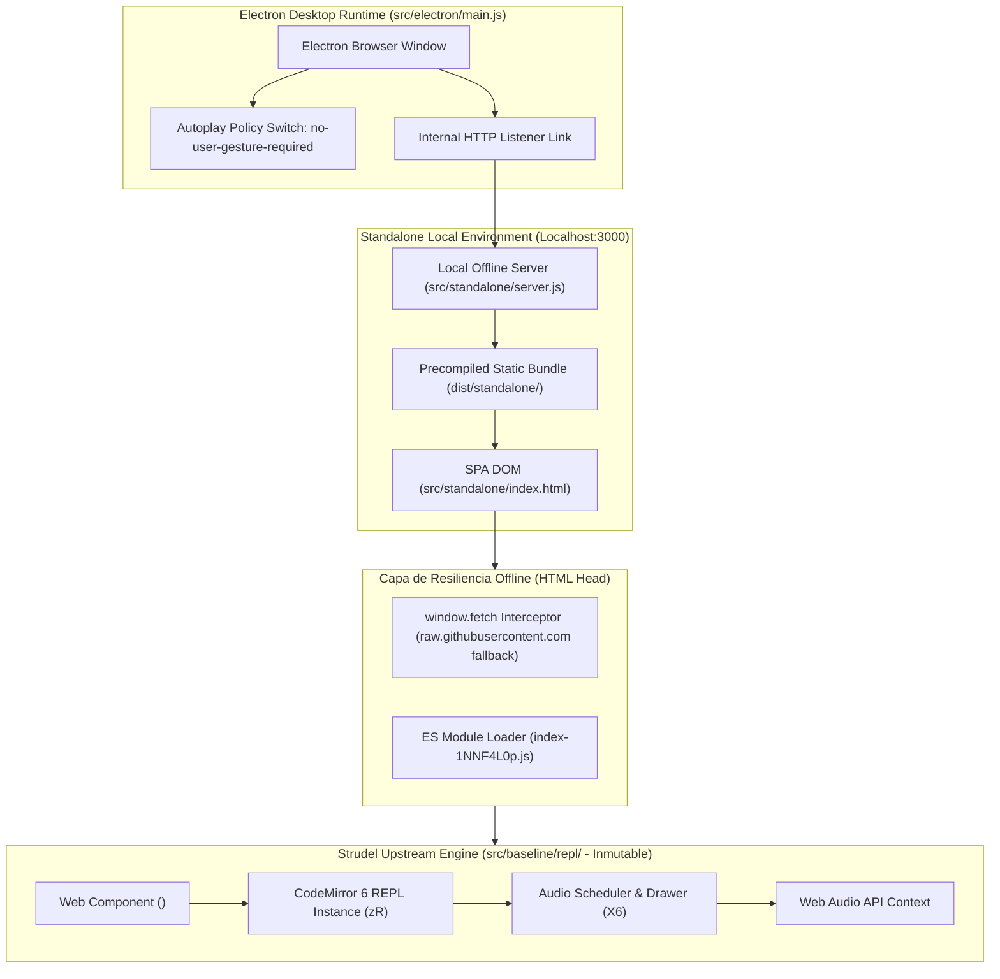
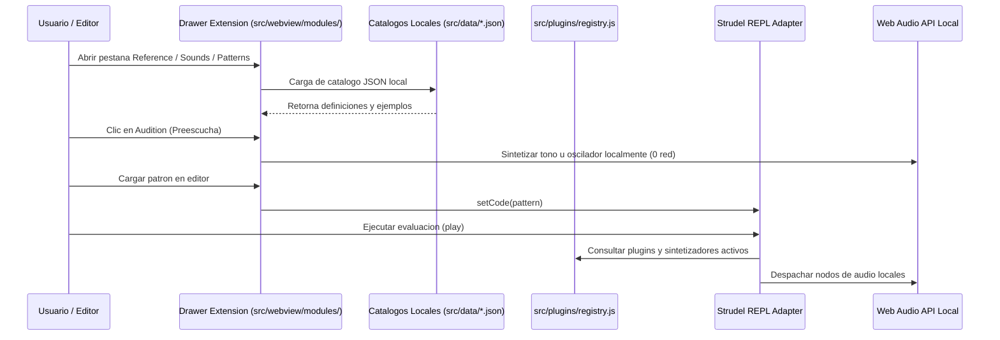
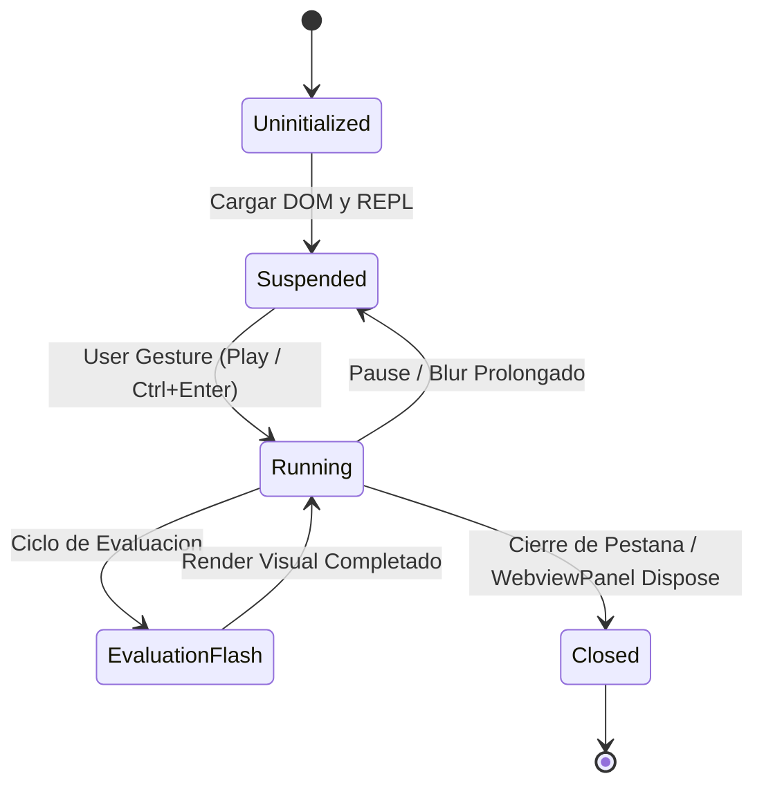
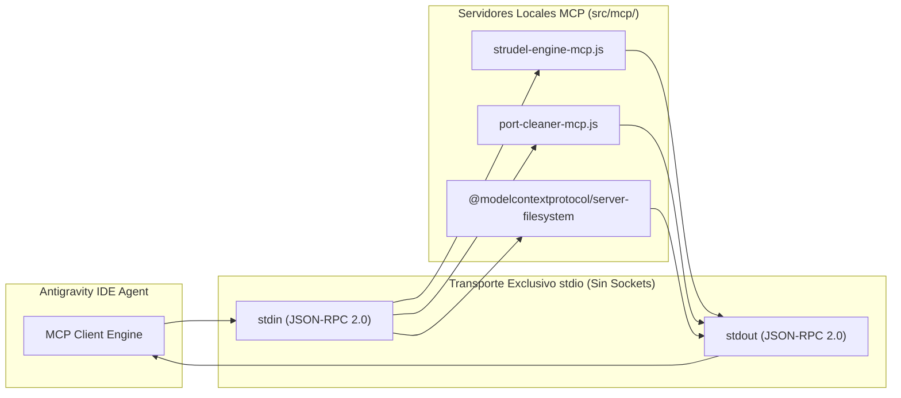

# ARQUITECTURA DEL SISTEMA: SWIRL LOCAL

## 1. VISION GENERAL Y REGLA DE ORO 0
Swirl implementa una arquitectura dual estricta y desacoplada disenada para operar 100% offline y de forma inmutable frente a los bundles base de upstream:
1. Modulo Local Standalone (Localhost): Servidor HTTP nativo en Node.js (src/standalone/server.js) escuchando estrictamente en http://127.0.0.1:3000/.
2. Aplicacion Desktop Electron: Runtime nativo de escritorio (src/electron/main.js) que empaqueta la experiencia Swirl REPL con politicas de audio permisivas (--autoplay-policy=no-user-gesture-required).

Nota de gobernanza: La extension VSIX para VS Code queda formalmente descartada y fuera de alcance.

Principios de Regla de Oro 0 integrados:
- Inmutabilidad de Upstream: Todo archivo en src/baseline/repl/ permanece virgen sin modificaciones locales.
- Resiliencia Offline de prebake(): Intercepcion transparente en el <head> de index.html para neutralizar fallos 503 o caidas de red contra raw.githubusercontent.com, garantizando que prebake() resuelva y beforeEval() no congele el scheduler.
- Componente Web en Modulo ES: index-1NNF4L0p.js se carga mediante <script type="module"> para instanciar CodeMirror y <strudel-editor>.
- Bus de Eventos Nativo: Comunicacion desacoplada via repl-evaluate y repl-stop.

---

## 2. TOPOLOGIA DEL SISTEMA



    subgraph ModularPlugins["Modular Plugins Layer (src/plugins/)"]
        PluginRegistry["Plugin Registry (registry.js)"]
        PluginManifest["Plugin Manifest (manifest.json)"]
        CustomSynths["Custom Synth Plugins"]
        CustomSyntax["Custom Mini-Notation Rules"]
        PluginRegistry --> CustomSynths
        PluginRegistry --> CustomSyntax
        PluginManifest --> PluginRegistry
    end

    subgraph DataCatalogs["Offline Data Catalogs (src/data/)"]
        RefCatalog["Reference Catalog (513 items)"]
        SoundsCatalog["Sounds & Drums Catalog"]
        PatternsCatalog["Official Patterns Library (30 items)"]
        ThemesCatalog["Themes Catalog (themes.json, 37 themes)"]
    end

    subgraph DrawerExtension["Dynamic UI Extension (src/webview/modules/)"]
        DrawerMod["Drawer Module (drawer-extension.js)"]
        SettingsMod["Settings Controller (settings-controller.js)"]
        WebAudioAudition["Local Web Audio Audition Engine"]
        DrawerMod --> WebAudioAudition
        DrawerMod --> RefCatalog
        DrawerMod --> SoundsCatalog
        DrawerMod --> PatternsCatalog
        SettingsMod --> ThemesCatalog
    end

    subgraph UpstreamBaseline["Upstream Isolated Baseline (src/baseline/)"]
        StrudelCore["Strudel Core Engine"]
        StrudelTranspiler["Mini-Notation Transpiler"]
        StrudelScheduler["Temporal Cycle Scheduler"]
    end

    IPCHost <-->|"postMessage (vscode.postMessage)"| WV_Client
    WV_Client --> DrawerMod
    WV_Client --> SettingsMod
    StandDOM --> DrawerMod
    StandDOM --> SettingsMod
    REPL_Adapter --> ModularPlugins
    REPL_Adapter --> UpstreamBaseline
    StandDOM --> ModularPlugins
    StandDOM --> UpstreamBaseline
```

---

## 3. AISLAMIENTO DE LINEA BASE, PLUGINS Y EXTENSION DEL IDE

Para garantizar claridad estructural y actualizaciones no destructivas del codigo oficial de Strudel:
- `src/extension/` (Singular): Backend de la extension para Antigravity IDE / VS Code. Administra el ciclo de vida del WebviewPanel y el canal IPC postMessage.
- `src/plugins/` (Plural): Capa modular desacoplada de plugins de audio para Strudel (anteriormente `src/extensions/`). Implementa el registro de hooks (`registerSynth`, `registerSyntax`, `registerVisualizer`) que se conectan al ciclo de vida del REPL sin tocar la linea base.
- `src/baseline/`: Contiene el nucleo de Strudel sincronizado desde upstream. Ninguna personalizacion local debe aplicarse en este directorio.
- `src/data/`: Catalogos estaticos JSON locales (`reference.json`, `sounds.json`, `patterns.json`, `themes.json`) para consumo offline inmediato por el drawer sin peticiones a la red en runtime (Regla de Oro 9).
- `src/webview/modules/`: Modulos de interfaz reactiva (`drawer-extension.js`, `settings-controller.js`) que gestionan la interaccion con los catalogos, preescucha sintetica y la configuracion visual del editor.



---

## 4. CICLO DE VIDA DEL AUDIO Y MANEJO DE BUFFERS

El subsistema de audio se ejecuta exclusivamente en el contexto del renderizador (Webview o navegador local) mediante Web Audio API:
1. Desacoplamiento total: El AudioContext no se vincula al proceso principal de Node.js de la extension host para evitar bloqueos del editor.
2. Politica de activacion: Por restricciones de navegadores modernos y Chromium en VS Code, el AudioContext permanece en estado `suspended` hasta que el usuario interactua con el editor (click o combinacion Ctrl+Enter / Cmd+Enter).
3. Buffers y Soundfonts: Todos los descriptores de sonido y archivos PCM se cargan desde el almacenamiento local offline mediante rutas relativas resueltas via Webview URI scheme (`webview.asWebviewUri`).
4. Fallback determinista: Cuando no existe dispositivo de salida de audio disponible, el motor evalua en modo silencioso (dry-run temporal) generando la secuencia de eventos sin lanzar excepciones.



---

## 5. INFRAESTRUCTURA MODEL CONTEXT PROTOCOL (MCP)

Para dotar al agente de introspeccion determinista y testing sin requerir navegadores ni sockets abiertos, el sistema integra servidores MCP locales con transporte estricto por tuberias `stdio`:



### Herramientas Expuestas por MCP
1. `strudel-engine-mcp`:
   - `validate_mini_notation`: Valida la sintaxis de mini-notation y retorna el AST o errores.
   - `dry_run_pattern`: Simula eventos temporales y notas en formato JSON estructurado.
   - `inspect_soundfonts`: Inspecciona bancos locales de sonido y descriptores.
2. `port-cleaner-mcp`:
   - `check_ports`: Audita procesos escuchando en puertos locales.
   - `kill_orphans`: Termina procesos huerfanos garantizando cero colisiones.
3. `project-filesystem-mcp`:
   - Servidor oficial de sistema de archivos con alcance restringido a `docs/`, `src/` y `.agent/`.
