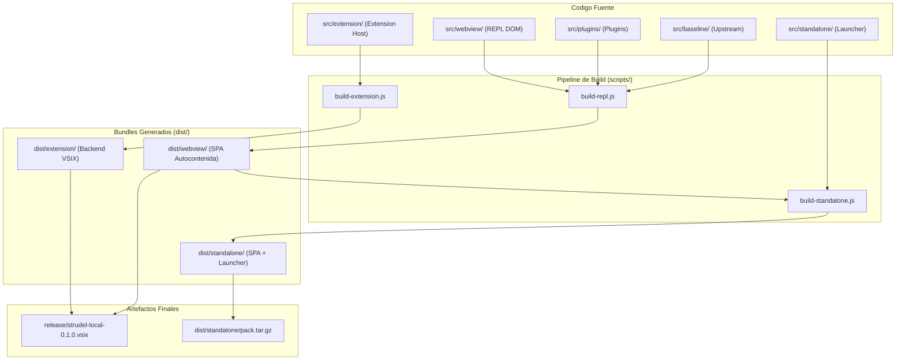

# GUIA DE EMPAQUETADO Y DISTRIBUCION: STRUDEL LOCAL

## 1. VISION GENERAL DEL PIPELINE DE BUILD
El proceso de empaquetado genera dos artefactos principales sin dependencias de red externas:
1. Extension `.vsix` para Antigravity IDE / VS Code conteniendo el Extension Host y el Webview bundle autocontenido.
2. Modulo Local Standalone conteniendo la SPA precompilada y el launcher en Node.js puro.



---

## 2. EMPAQUETADO VSIX (ANTIGRAVITY IDE / VS CODE)

### 2.1. Resolucion de Recursos en Webview
El Webview de VS Code impone una estricta Politica de Seguridad de Contenido (CSP) y no permite cargar scripts directamente mediante rutas relativas estandar.
En `src/extension/extension.js`:
```javascript
const scriptUri = webview.asWebviewUri(
  vscode.Uri.joinPath(extensionUri, 'dist', 'webview', 'main.js')
);
const styleUri = webview.asWebviewUri(
  vscode.Uri.joinPath(extensionUri, 'dist', 'webview', 'style.css')
);
```

### 2.2. Content Security Policy (CSP)
El contenedor HTML inyecta un encabezado CSP estricto con `${webview.cspSource}`:
```html
<meta http-equiv="Content-Security-Policy" content="default-src 'none'; img-src ${webview.cspSource} https: data: blob:; script-src ${webview.cspSource} 'unsafe-inline' 'unsafe-eval' blob:; style-src ${webview.cspSource} 'unsafe-inline'; font-src ${webview.cspSource} data:; worker-src ${webview.cspSource} blob:; connect-src ${webview.cspSource} data: blob:;">
```

### 2.3. Ejecucion del Empaquetado e Instalacion
```bash
# 1. Empaquetar el archivo VSIX directamente en el directorio release/
npm run package:vsix

# 2. Instalar el paquete en Antigravity IDE directamente desde release/
npm run install:ide

# O mediante la CLI nativa de Antigravity IDE:
"/Applications/Antigravity IDE.app/Contents/Resources/app/bin/antigravity-ide" --install-extension release/strudel-local-0.1.0.vsix --force
```
El script genera el artefacto en `release/strudel-local-0.1.0.vsix` validando previamente que no existan enlaces rotos ni dependencias remotas.

---

## 3. EMPAQUETADO STANDALONE OFFLINE

### 3.1. Estructura del Modulo Standalone
```
dist/standalone/
├── index.html
├── main.js
├── style.css
├── assets/
│   ├── soundfonts/
│   └── samples/
└── server.js
```

### 3.2. Ejecucion
El modulo standalone se ejecuta directamente con Node.js sin necesidad de dependencias externas:
```bash
node dist/standalone/server.js
```
El servidor escucha en el puerto configurado (predeterminado 3000) y responde unicamente peticiones locales (localhost / 127.0.0.1).
